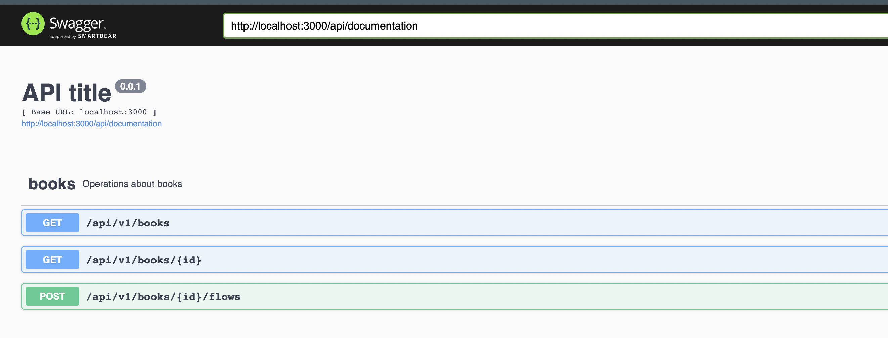

# README

This repository aims to provide a practical way to implement `grape-api` with rails 7.0.

Which simulates a book store functionality services that can retrieve batch of books
or a specific book.

Then create a flow of books which describe pick/put actions on
a bookshelf.

This repository uses gem `grape-swagger` to document the api endpoints and schemas.

References:
- https://www.thegreatcodeadventure.com/making-a-rails-api-with-grap/
- https://medium.com/@clementrollon/build-a-basic-api-with-grape-api-grape-entity-part-1-5d5fa1cf38db